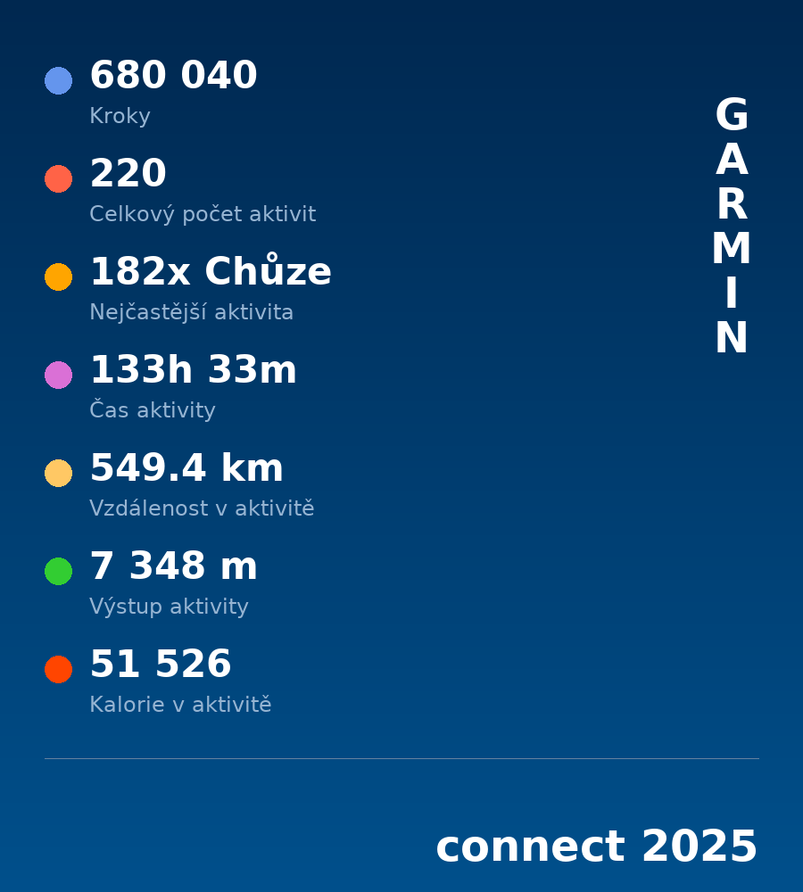

# Garmin Activity Summary Generator

Generate a visual year-end activity summary from Garmin Connect data.



## Requirements

- Docker

## Usage

1. Export activities from [Garmin Connect](https://connect.garmin.com/modern/activities) to `data/Activities.csv`

   - **Note:** Only visible/loaded activities are exported (scroll down to load the entire period).

2. Run the generator:
```bash
make generate
```

3. Find your summary image at `data/garmin-<year>.png`

## Makefile commands

| Command                     | Description                        |
|-----------------------------|------------------------------------|
| `make build`                | Build Docker image                 |
| `make generate`             | Build image and generate summary   |
| `make generate YEAR=2024`   | Generate summary for specific year |
| `make clean`                | Remove generated PNG files         |

## Parameters

| Variable | Description                  | Default      |
|----------|------------------------------|--------------|
| `YEAR`   | Filter activities by year    | current year |

## Metrics displayed

- Steps
- Total activities
- Most frequent activity
- Activity time
- Distance (km)
- Elevation gain (m)
- Calories

## Project structure

```
.
├── data/
│   └── Activities.csv       # Input data (Garmin Connect export)
├── Dockerfile
├── Makefile
├── generate_summary.py      # Main script
├── requirements.txt         # Python dependencies
├── LICENSE
└── README.md
```

## License

MIT
